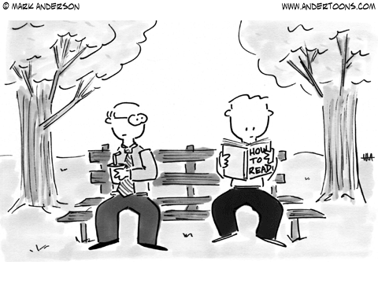

# Can Code Measure Experience?
## a thought exercise in the digital humanities
### by: Juliana Torres and Maya Kline-Sharpe

----

###  Abstract 

This theoretical group project studied and explored the new alternatives for content analysis and researchers' expectations in the field. The project tried to identify how academics revisited text analysis methods to create relevant and insightful studies that could benefit future scholars. For this presentation, our group read and referenced Toward a computational hermeneutics by Mohr et al., We are all social scientists now by Grimmer, and Owen's Defining Data for Humanists. From those readings, we sought to learn the history and early goals of content analysis to understand the need and demand for new methods as the discipline evolves. We were also interested in learning how Humanists have brought their practices to this computational field and how they have impacted its development. Of these practices, we focused on what has been called "computational hermeneutics," the technique of using close reading techniques and rhetorical analysis to gather more nuanced and overlapping meanings from a text. As an example of the types of projects using this method to extract meaning from a large body of text, we presented Mohr and his team's rhetorical analysis of the National Security texts from presidents Clinton and Bush. Using a mixture of digital tools like NER and humanistic tools like hermeneutics, the researchers were able to map a significant change in message communication between these administrations. I collaborated on the project by drafting the topic proposal, researching computational hermeneutics in Mohr's research, and brainstorming future study and next steps for this project. Maya and I worked well together despite the uncertainty of our topic and division of labor with a classmate in a different timezone. We want to expand the project to understand how these humanistic methods might introduce new biases into a textual analysis project. 
